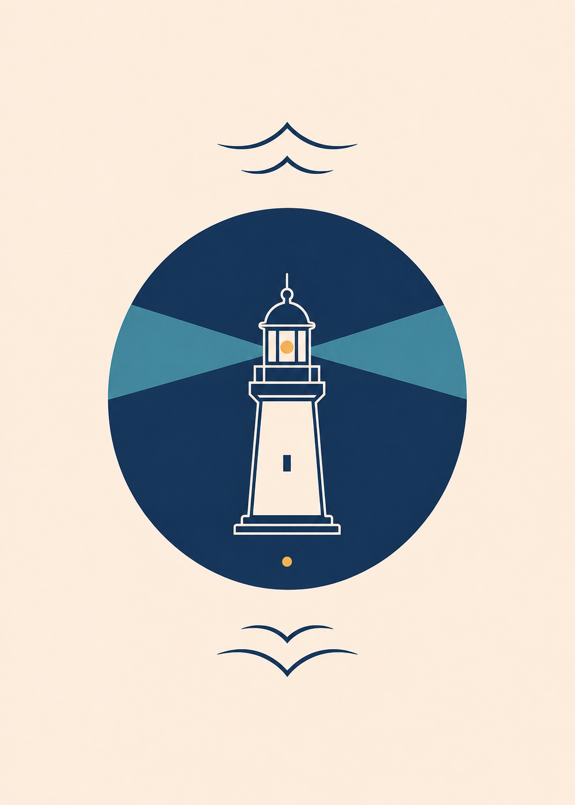
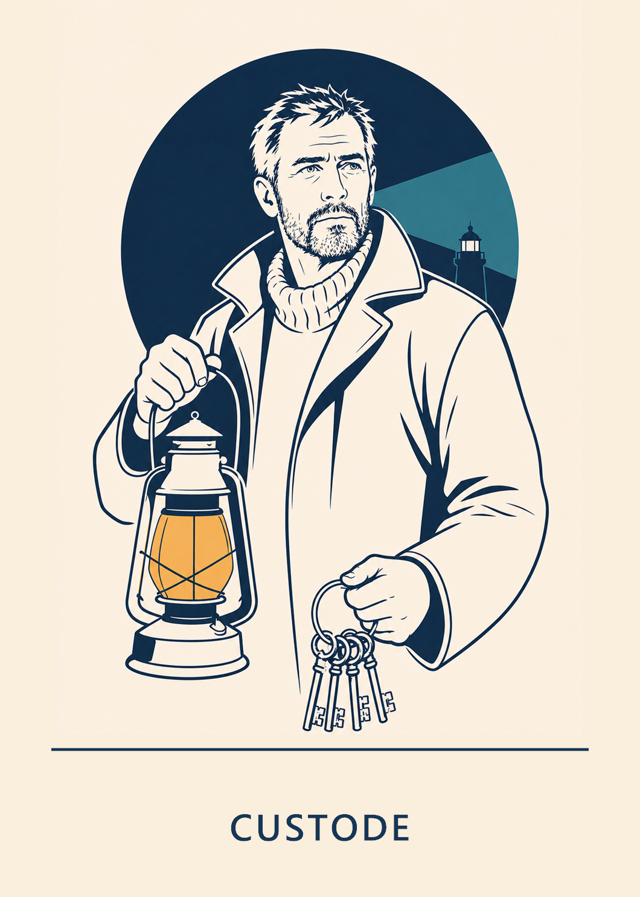
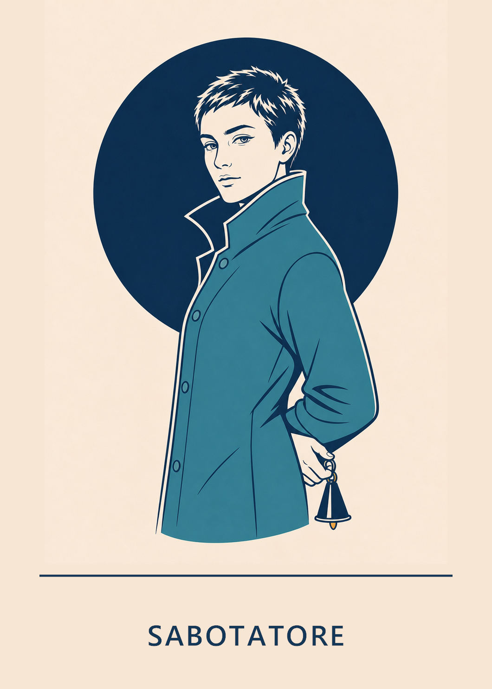
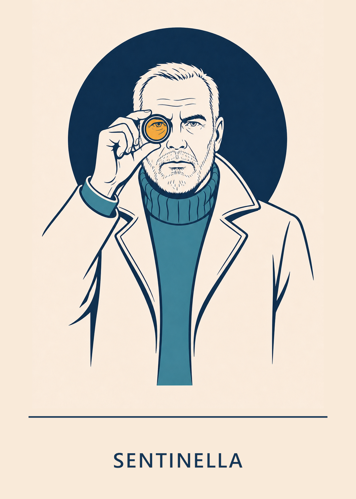
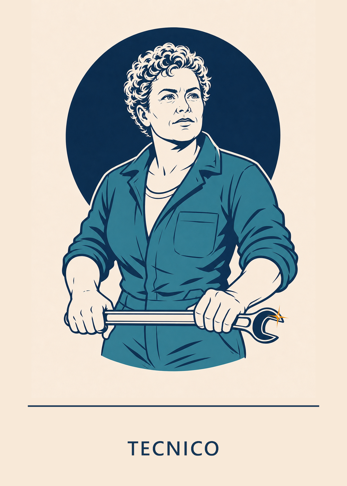
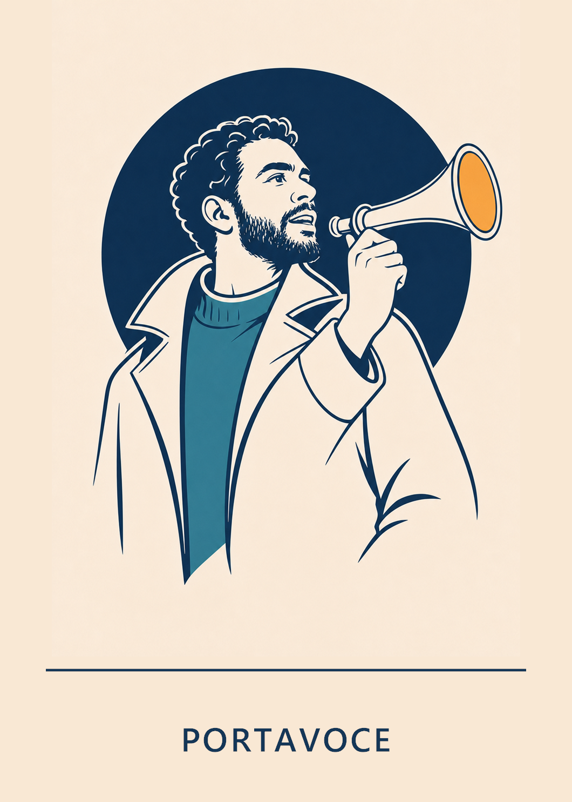
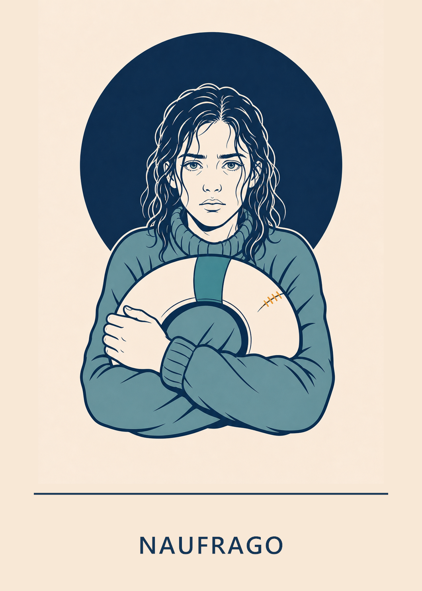
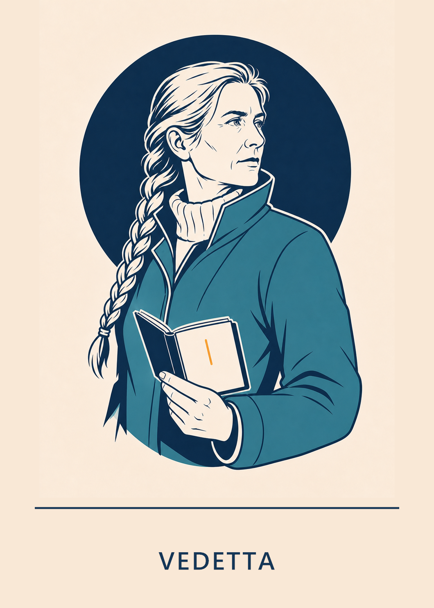
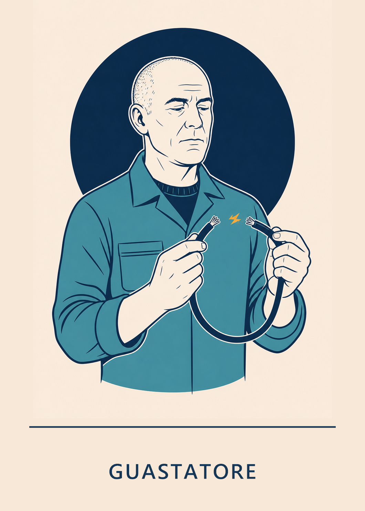

# Set illustrato minimale

Questa è la prima serie completa di illustrazioni coordinate per le carte di
**Blackout al Faro**. La direzione scelta deriva dalla variante **F —
Illustrazione editoriale a linea** del Custode.

Le illustrazioni originali non contengono testi o simboli di fazione. La
cartella [`labelled`](labelled/) contiene una seconda serie non distruttiva con
il nome del ruolo sotto l'immagine, pensata per rendere le carte immediatamente
riconoscibili.

## Dorso

Il faro, i due fasci di luce e i segni speculari del mare formano un motivo
semplice e riconoscibile anche quando la carta è vista da lontano.

## Personaggi con nome

| Custode | Sabotatore | Sentinella |
|---|---|---|
|  |  |  |

| Tecnico | Portavoce | Naufrago |
|---|---|---|
|  |  |  |

| Vedetta | Cartografa della Baia | Guastatore |
|---|---|---|
|  |  |  |

Le versioni senza nome restano nella cartella corrente come sorgenti
riutilizzabili.

## Grammatica visiva

- formato verticale vicino al rapporto 5:7;
- fondo avorio e grande cerchio blu notte;
- disegno editoriale a linea blu, con campiture piatte;
- un'area verde petrolio e un piccolo accento ambra;
- un solo oggetto-simbolo per ruolo;
- nessun testo incorporato nell'illustrazione e nessun elemento che identifichi
  la fazione soltanto attraverso il colore.

## Fascia del titolo

- area separata sotto l'illustrazione da un filetto blu notte;
- nome in maiuscolo, centrato e sempre su una sola riga;
- Segoe UI Semibold rasterizzato nel PNG, quindi non dipendente dai caratteri
  installati sul dispositivo;
- corpo e spaziatura costanti per tutti i ruoli; soltanto la spaziatura di
  `CARTOGRAFA DELLA BAIA` viene leggermente ridotta;
- margine laterale minimo pari all'8% della larghezza della carta.

Le carte etichettate possono essere rigenerate eseguendo
[`build-labelled-cards.ps1`](build-labelled-cards.ps1) da PowerShell.

## Oggetti-simbolo

| Ruolo | Oggetto | Significato |
|---|---|---|
| Custode | Lanterna e chiavi | Custodia del faro |
| Sabotatore | Spegni-fiamma | Eliminazione della luce |
| Sentinella | Lente | Verifica dell'allineamento |
| Tecnico | Chiave inglese | Intervento d'emergenza |
| Portavoce | Cornetta nautica | Ultima dichiarazione pubblica |
| Naufrago | Salvagente | Sopravvivenza |
| Vedetta | Registro di ronda | Presenza di un'azione notturna |
| Cartografa della Baia | Carta con due punti | Confronto tra due giocatori |
| Guastatore | Cavo reciso | Interruzione temporanea dei poteri |

Sentinella e Vedetta sono state differenziate intenzionalmente: la prima guarda
attraverso una lente e scopre una natura; la seconda osserva l'ambiente e
registra un'attività senza usare strumenti ottici.

## Stato degli asset

Questi PNG sono **illustrazioni di concept**, non carte esecutive di stampa.
Mancano ancora:

1. gabbia grafica definitiva con fazione, categoria e testo del potere;
2. icone accessibili anche senza colore;
3. abbondanza, zona sicura e profilo colore richiesti dalla tipografia;
4. esportazioni ottimizzate per l'app;
5. prova di leggibilità con carte stampate nelle dimensioni reali.

La generazione è stata guidata da un prompt comune basato sulla variante F e
da un breve specifico per ciascun ruolo. Il Custode è stato usato come
riferimento visivo per mantenere palette, tratto, scala e composizione coerenti.
