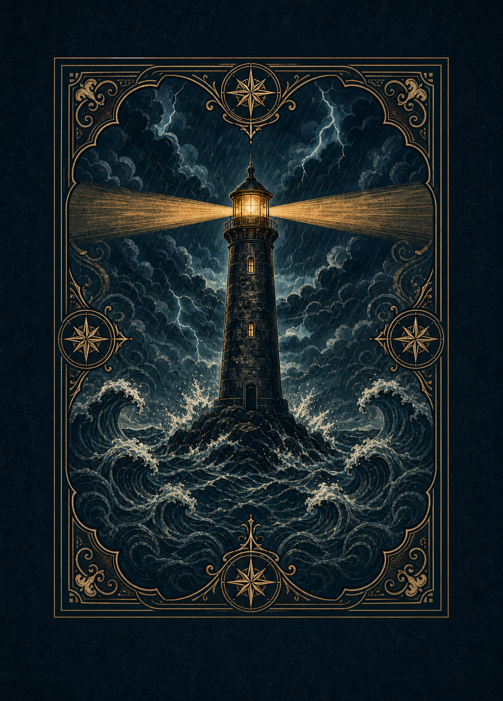
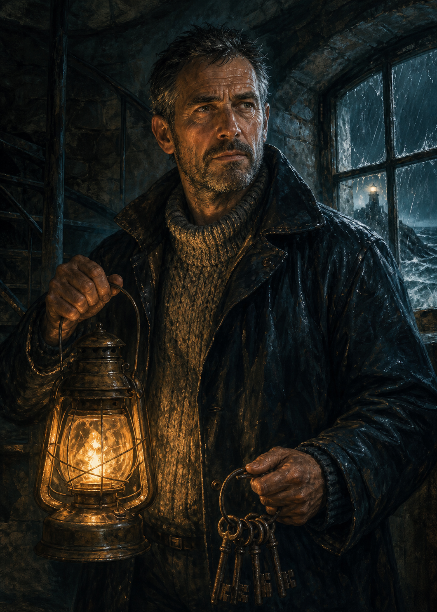
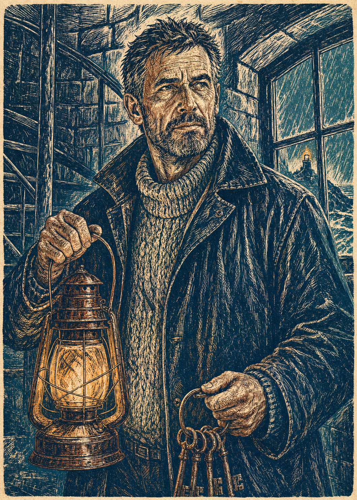
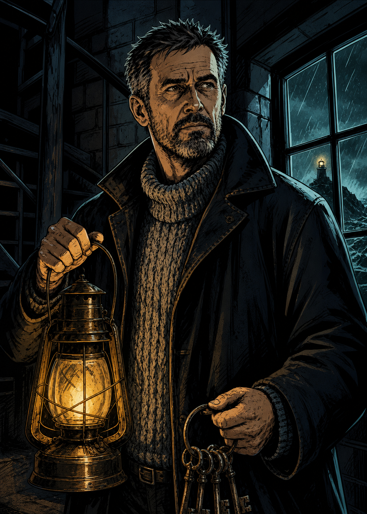

# Concept art delle carte

Prima esplorazione visiva per le carte fisiche e digitali di **Blackout al Faro**.

Questi file sono concept ad alta risoluzione, non ancora esecutivi di stampa: nome, categoria, fazione, testo del potere e icone verranno aggiunti separatamente dopo la scelta dello stile. Tutte le immagini sono prive di testo incorporato, così potranno essere riutilizzate nell'app e in formati differenti.

## Dorso — Il sigillo del faro

Il dorso utilizza una composizione centrale con faro, tempesta e ornamenti marittimi. La fascia scura esterna mantiene la cornice lontana dall'area di taglio. Prima della stampa definitiva dovrà comunque essere inserito nel tracciato con abbondanza previsto dalla tipografia.

## Custode — varianti di stile

Le tre proposte mantengono lo stesso personaggio, posa, abbigliamento, lanterna, chiavi, ambiente e contrasto tra luce fredda e calda. Cambia soltanto il linguaggio illustrativo.

| A — Pittorico cinematografico | B — Incisione marittima | C — Graphic novel noir |
|---|---|---|
|  |  |  |
| Realismo illustrato, materico e immersivo. | Palette limitata e segno da linoleografia, molto riconoscibile in stampa. | Campiture nette, forte contrasto e ottima leggibilità in piccolo. |

## Elementi comuni da conservare

- formato verticale vicino al rapporto delle carte da poker;
- personaggio leggibile dalla testa alla vita;
- volto, mani e oggetto distintivo dentro la zona sicura;
- blu notte e verde petrolio per l'ambiente;
- luce ambrata come punto focale;
- atmosfera tesa e marina, senza elementi horror espliciti;
- nessun testo generato dentro l'illustrazione;
- nessun colore come unico indicatore di fazione o categoria.

## Prossimo passaggio

Scegliere lo stile **A**, **B** oppure **C**. Dopo la scelta verranno progettati gli altri personaggi con la stessa grammatica visiva e verrà realizzato separatamente il sistema grafico della carta.
